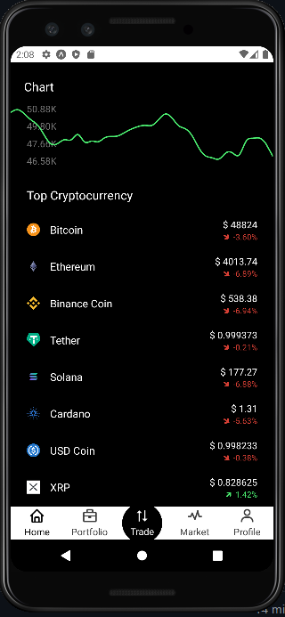
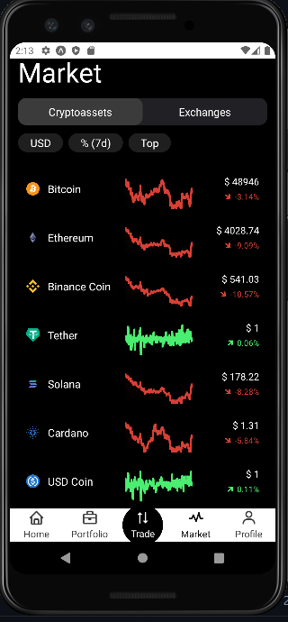
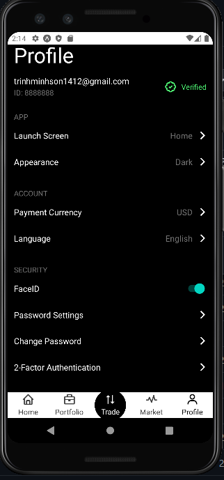

# Project Title

Crypto Wallet application to see the price and chart of top coins, live chart and track the portfolio 


## Installation

Install my-project with npm

```bash
  npm install my-project
  cd my-project
```
    
## Screenshots

<p>Home Screen</p>


<p>Market Screen</p>


<p>Profile Screen</p>



## Tech Stack

**Client:** React Native, React Thunk, React Redux, Axios, React Native Chart Kit

**API:** Coingecko API


## Demo

Insert gif or link to demo
